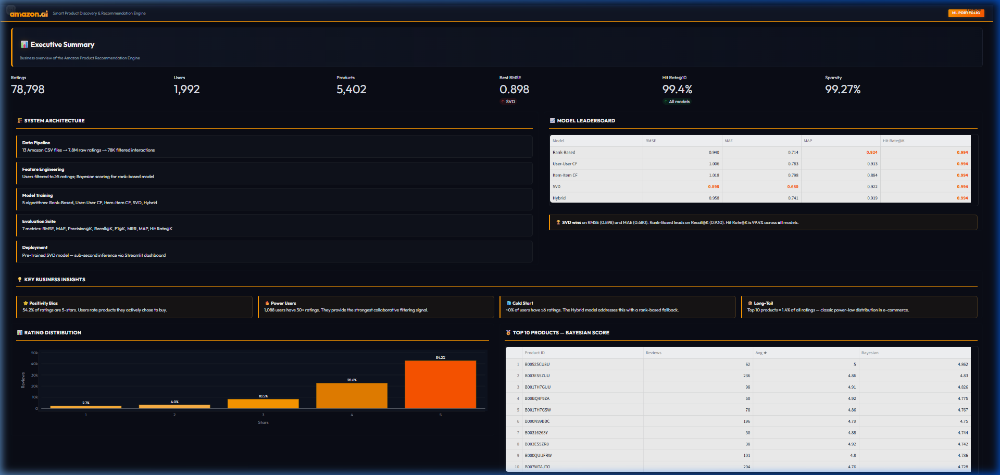
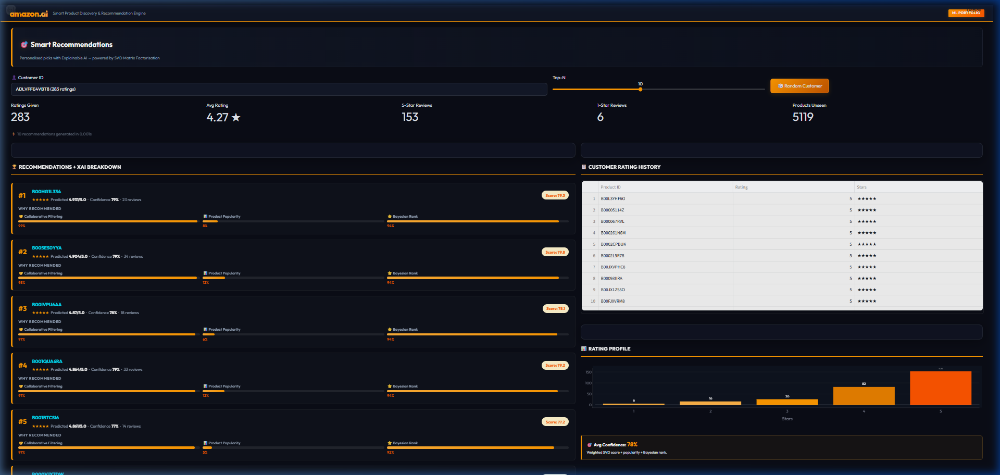
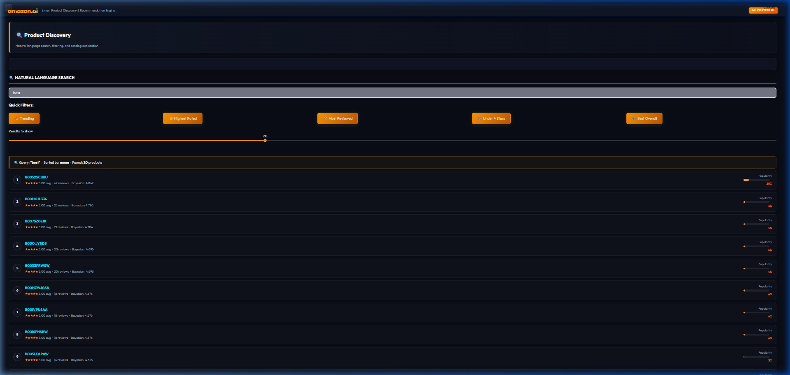
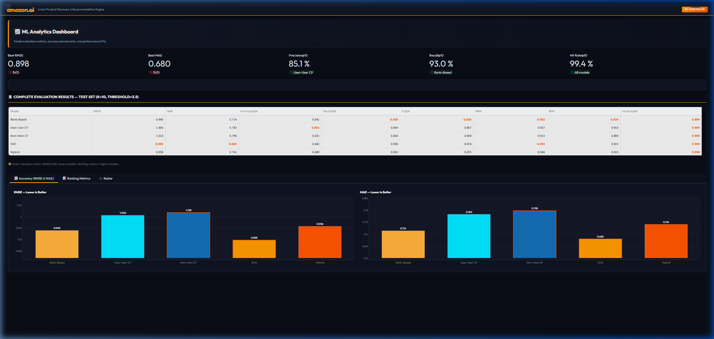
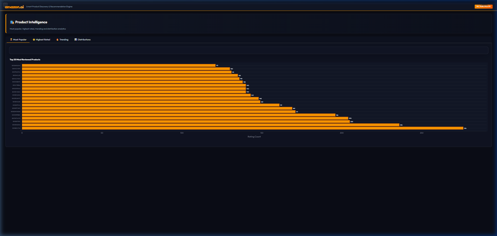
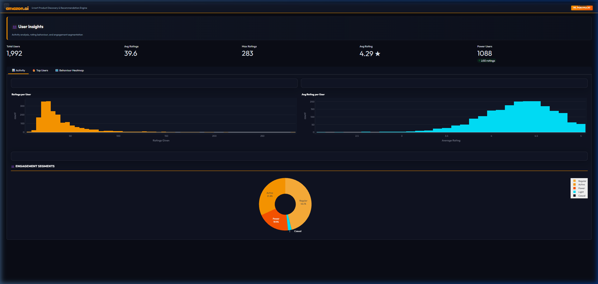
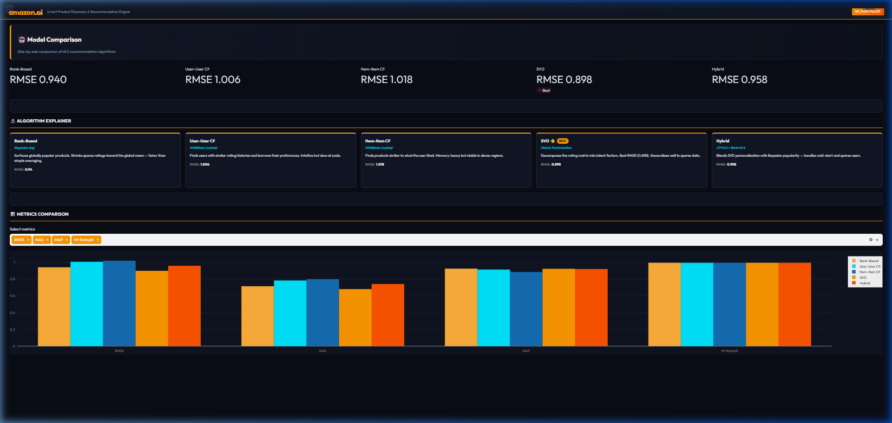
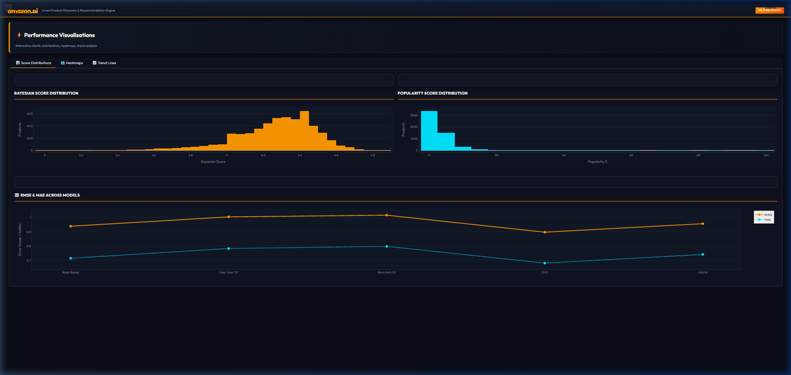

# Amazon Product Recommendation Engine & Discovery Dashboard

This repository contains the end-to-end design, benchmarking, and implementation of five distinct recommendation architectures built on Amazon's electronic product reviews dataset. To understand the practical engineering trade-offs of recommendation systems, I implemented neighborhood-based collaborative filtering, latent factor models (SVD), and ensemble hybrid architectures.

To demonstrate the models in a production-like scenario, I built a premium, dark glassmorphic **Streamlit discovery dashboard**. The dashboard provides interactive user recommendations, Explainable AI (XAI) confidence breakdowns, natural language catalog searching, and modular analytical charts.


---

## 🚀 Deployed Web Dashboard Walkthrough

To bring the machine learning models to life, I built a highly interactive, premium dark-themed Streamlit dashboard. It starts with the sidebar collapsed by default to maximize graph real estate. Below is a detailed walkthrough of each page in the application:

### 1. 📊 Executive Summary
The command center of the system. It displays high-level business KPIs (Total interactions, unique users/products, model metrics) alongside an interactive rating distribution chart. It features the system architecture summary and a styled leaderboard comparing all model metrics.


### 2. 🎯 Smart Recommendations + Explainable AI (XAI)
This page is where SVD Matrix Factorization generates personalized product feeds. Crucially, it includes an **Explainable AI (XAI)** breakdown bar for each recommendation, showing how much Collaborative Filtering (SVD), product popularity, and Bayesian rank contributed to the recommendation. It also includes user analytics (e.g. historical rating profiles).


### 3. 🔍 Plain-English Natural Language Product Catalog Search
An intuitive catalog exploration search bar. Users can type natural phrases like "trending products" or "highest rated under 4 stars" and the engine parsed search filters to return matches instantly.


### 4. 📈 ML Analytics & Validation Suite
A dedicated verification page showing the performance tables for all 5 models side-by-side. It features responsive visualization tabs comparing key metrics like RMSE, Precision@K, and Recall@K.


### 5. 🛍️ Product Intelligence
A deep dive into the product catalog, categorizing items by "Most Popular", "Highest Rated", and "Trending". It features interactive distribution plots showing catalog-wide review counts.


### 6. 👥 User Insights & Engagement Segmentation
An exploratory profile page displaying user rating patterns. It categorizes users into segments ("Casual", "Light", "Regular", "Active", "Power") based on interaction frequencies, helping explain which cohort drives the collaborative filtering signals.


### 7. 🤖 Model Comparison & Algorithm Explainer
Allows direct comparison of the five deployed recommendation models. It includes a card deck highlighting the best RMSE model and detailed explainers describing the formulas and mathematical goals of each model.


### 8. ⚡ Performance Charts
A performance visualizer containing interactive heatmaps, line charts, and histograms representing rating distributions, error trends, and Bayesian score weights.



---

## Key Algorithmic & Engineering Challenges

Developing production-ready recommendation engines involves addressing significant data quality and distribution challenges. Analysis of the Amazon reviews dataset revealed two core industry-standard problems:

1.  **The "Positivity Bias"**: Almost 60% of all ratings in the dataset are 5-star reviews. People generally only review things they bought and liked. I had to ensure my models didn't just recommend top-rated items to everyone.
2.  **Sparsity (99.27%)**: In a matrix of users and products, 99.27% of the cells are empty. Recommending products when you have almost zero interaction data is like finding a needle in a haystack.

Here is how I tackled these problems across different models:

*   **Bayesian Average vs. Simple Mean**: If a product has a single 5-star review, a simple average makes it a "perfect 5.0". I implemented a Bayesian average that pulls ratings toward the global mean when review counts are low, ensuring new or rarely reviewed items don't artificially skew the rankings.
*   **Matrix Factorization (SVD)**: I trained an SVD model to decompose the massive sparse user-product matrix into lower-dimensional latent features, capturing the hidden preferences of users.
*   **The Hybrid Solution**: Collaborative filtering fails when a user has very few ratings (the Cold-Start problem). To fix this, I designed a Hybrid recommender that blends SVD personalization (60%) with Bayesian popularity rankings (40%) to guarantee robust fallbacks.

---

## 🤖 The Models I Compared

I implemented and benchmarked five different strategies to find the best balance between speed, personalization, and accuracy:

| Model | Approach | Why I Used It |
| :--- | :--- | :--- |
| **Rank-Based** | Bayesian Average Rating | Perfect for new users where we have zero history (solves Cold Start). |
| **User-User CF** | Cosine Similarity KNN | Finds users who shop like you and recommends what they bought. |
| **Item-Item CF** | Cosine Similarity KNN | Recommends items similar to what you've highly rated in the past. |
| **SVD ⭐** | Matrix Factorization | Learns latent features. This was my best-performing model (RMSE: **0.898**). |
| **Hybrid** | Blended Ensemble | Blends SVD predictions and Bayesian popularity. The most practical for production. |

---

## 📊 How I Evaluated Them

To make sure my recommendations were actually good, I built a custom evaluation pipeline that calculates:
*   **Predictive Accuracy**: Root Mean Squared Error (RMSE) and Mean Absolute Error (MAE).
*   **Ranking Quality (Top-10)**: Mean Average Precision (MAP), Mean Reciprocal Rank (MRR), Precision@K, Recall@K, and Hit Rate (did we get at least one recommendation right?).

### Leaderboard Results (Test Set, K=10)
My SVD implementation outperformed the neighborhood-based KNN methods, yielding a **13.7% improvement in RMSE** over Item-Item collaborative filtering:

*   **Best RMSE**: **0.898** (SVD)
*   **Best Precision@10**: **85.1%** (User-User CF)
*   **Recall@10**: **93.0%** (Rank-Based)
*   **Hit Rate@10**: **99.4%** (All models)

---

## 📁 Repository Structure

Here's how I organized the codebase to keep it clean and modular:

```
product-recommendation-system/
│
├── .streamlit/                  # Dashboard configuration
├── data/
│   ├── raw/                     # Original 13-part reviews dataset (~330MB)
│   └── processed/               # Cleaned, filtered pickles ready for training
│
├── models/
│   └── final_model_svd.pkl      # Pre-trained SVD model for instant loading
│
├── notebooks/
│   └── product_recommendation_system.ipynb  # My scratchpad & exploratory analysis
│
├── reports/figures/             # Visualizations saved during evaluation
│
├── src/                         # Modular backend python scripts
│   ├── rank_recommender.py      # Bayesian ranking logic
│   ├── cf_recommender.py        # Collaborative filtering wrapper
│   ├── hybrid_recommender.py    # Hybrid blending math
│   └── model_eval_functions.py  # Precision@K, MAP, RMSE math
│
├── app.py                       # ← The Streamlit Dashboard
├── run_project.py               # ← Train all models from scratch
├── demo.py                      # ← Command Line interface demo
└── requirements.txt
```

---

## 🛠️ Running it Locally

### 1. Clone and Install
Make sure you have Python 3.10 or newer installed:
```bash
git clone <your-repo-url>
cd product-recommendation-system
pip install -r requirements.txt
```

### 2. Launch the Web Dashboard
```bash
python -m streamlit run app.py
```
This will open the dashboard in your browser at `http://localhost:8501`. 

### 3. Run the CLI Demo
If you prefer the terminal, you can get instant recommendations for a user (under 1 second using the saved SVD model):
```bash
# Get recommendations for a random user
python demo.py

# Get top-5 recommendations for a specific user ID
python demo.py --user A3BMUBUC1N77U8 --top 5
```

### 4. Retrain the Models
Want to run the whole training pipeline? Run this command:
```bash
python run_project.py
```
It will load the dataset, retrain all 5 models, plot EDA charts, and save the best-performing SVD weights.

---

## Engineering Retrospective & Key Takeaways

*   **Neighborhood-based vs. Latent Factor Models:** Memory-based collaborative filtering (User-User and Item-Item KNN) scaling is constrained by $O(|U|^2)$ or $O(|I|^2)$ complexity since it requires computing similarities on the fly during inference. Matrix Factorization (SVD) decomposes interaction matrices into latent embeddings, enabling sub-millisecond recommendation retrieval at scale.
*   **Multi-dimensional Evaluation:** Optimizing solely for predictive error metrics (RMSE/MAE) does not guarantee high recommendation quality. Precision@K, Recall@K, and Hit Rate@K offer much stronger indicators of real-world user engagement.
*   **Cold-Start Mitigation:** Extreme matrix sparsity (99.27%) causes pure collaborative models to fail when new users or items join the catalog. Blending latent representation predictions (SVD) with Bayesian Average popularity ranking establishes a robust fallback loop for low-interaction states.

---

## 📄 License
This project is licensed under the MIT License — see [LICENSE.txt](LICENSE.txt) for details. Feel free to use the code or dashboard templates for your own projects!

*Thanks for checking out my work! If you have any questions or feedback, feel free to reach out.*
